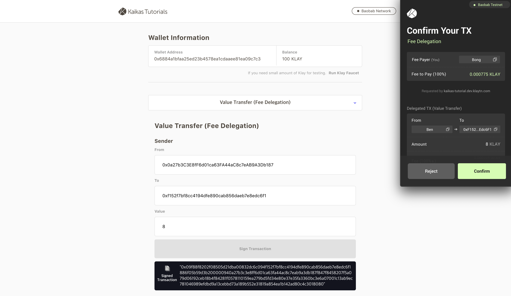

# Kaikas Tutorial

> [tutorial.kaikas.io](tutorial.kaikas.io)



### 1) Introduction
Kaikas Tutorial is a reference BApp that works with Kaikas. You can send Klaytn's various types of transactions in the Kaikas tutorial and refer to the source code to create your BApp.

### 2) Getting started
1. Open terminal
2. Clone the repo by running `git clone https://github.com/klaytn/kaikas-tutorial.git`
3. `cd kaikas-tutorial`
4. Run `npm install` to install node packages
5. Run `npm run local`
6. App should be running on https://localhost:8888

#### Builds the app for production
1. Run `npm run build` to build app
2. Run `npm start`
3. App should be running on https://localhost:5555


### 3) npm package information
> dependencies
```
The Kaikas Tutorial project is optimized for caver-js version "1.3.2".
caver-js needs confirmation before updating.
```

### 4) Directory Structure
> Folder structure
```
webpack.base.js         // Base webpack settings
webpack.dev.js          // Settings for local development
webpack.prod.js         // Settings for build. (note: NODE_ENV= must be set to production)

dist                    // Files built with 'npm run build'
static                  // Contains static resources (index.html, images, font files etc...)

1. src
src - pages             // React page components
src - components        // React components
src - constants         // Constants used throughout the project
src - klaytn            // Klaytn related definition folder
src - styles            // Style util files. Contains color, size, font info and etc. as well as Sass at-rules
index.js                // Project build entry point.
index.scss              // .scss file for index.js mentioned above.
```

### 5) Web browser support scope
> Supported browsers.

Chrome | Safari | Firefox | IE Edge*
---------------------- | ---------------------- | ---------------------- | ----------------------
Supported (Optimized) | Supported | Supported | Not supported

### 6) License
Kaikas Tutorial is released under the [MIT license](./LICENSE).

```
MIT License

Copyright (c) 2020 Kaikas Tutorial Authors

Permission is hereby granted, free of charge, to any person obtaining a copy
of this software and associated documentation files (the "Software"), to deal
in the Software without restriction, including without limitation the rights
to use, copy, modify, merge, publish, distribute, sublicense, and/or sell
copies of the Software, and to permit persons to whom the Software is
furnished to do so, subject to the following conditions:

The above copyright notice and this permission notice shall be included in
all copies or substantial portions of the Software.

THE SOFTWARE IS PROVIDED "AS IS", WITHOUT WARRANTY OF ANY KIND, EXPRESS OR
IMPLIED, INCLUDING BUT NOT LIMITED TO THE WARRANTIES OF MERCHANTABILITY,
FITNESS FOR A PARTICULAR PURPOSE AND NONINFRINGEMENT. IN NO EVENT SHALL THE
AUTHORS OR COPYRIGHT HOLDERS BE LIABLE FOR ANY CLAIM, DAMAGES OR OTHER
LIABILITY, WHETHER IN AN ACTION OF CONTRACT, TORT OR OTHERWISE, ARISING FROM,
OUT OF OR IN CONNECTION WITH THE SOFTWARE OR THE USE OR OTHER DEALINGS IN
THE SOFTWARE.
```

### 7) Contributing

As an open source project, Kaikas Tutorial is always welcoming your contribution. Please read our [CONTTIBUTING.md](./CONTRIBUTING.md) for a walk-through of the contribution process.
